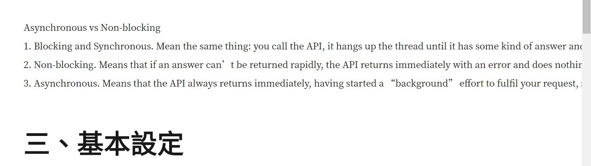

MARKDOWN語法: https://markdown.tw/

### 1. 程式碼區塊顯示不完整、不好看
如下面這個案例，區塊裡的文字太長超過了頁面。

 
或是下面這個案例，程式碼沒有很好的上色並且區分不同語言。

### 2. 應該自動生成header
當建立一個md檔後，可以有快捷鍵自動產生現在時間日期，不用再手動輸入。

### 3. jekyll優化搭配seo
了解一下jekyll的用法，優化一下seo。

### 4. 文章管理方法或系統
找能大量管理文章的方法或工具，可以用tag來區別文章，或是建立自己的系統。。

### 5.  md語法不熟悉
需要參考上面的文件，熟悉幾個常用的語法。