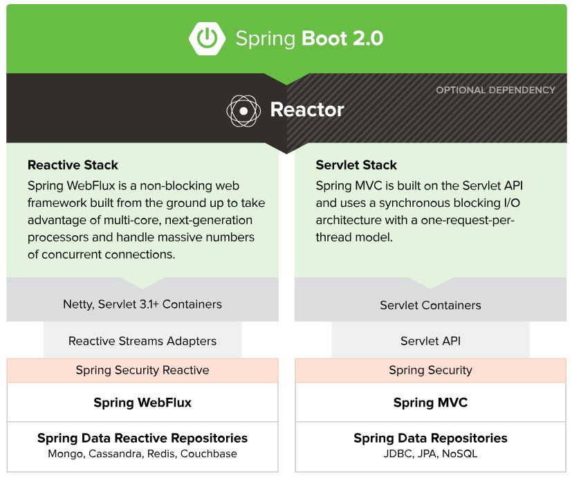
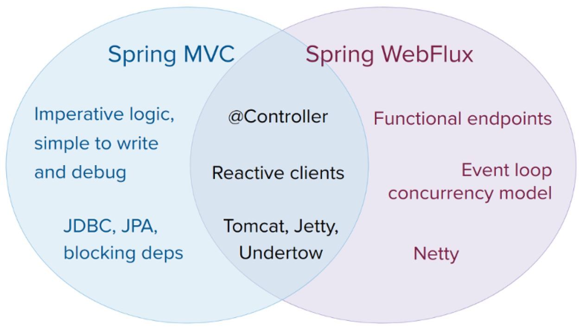

# 一、什麼是spring webflux

在spring 5中正式發表，相比於我們常用的同步、阻斷式Spring MVC，Spring boot，webflux是一種非同步、非阻斷、reactive、函數式的java web框架。

以 Reactor library為基礎，實現了Reactive Streams規範。

相關觀念:RxJava/RxJava 2，或是Java 9的Flow API、functinal programming、訂閱者模式、生產消費者模式。

其他相似的框架:Vert.x

```
雖然Web Flux的API在某些地方，確實提供了阻斷的選項，若單純只是試著將基於Web MVC的應用程式，改寫為套用Web Flux，並不會有任何益處，反而會窮於應付如何在Web Flux實現對應的方案。例如，此時，Spring Security顯然就不能用了，畢竟是Spring基於Servlet的安全方案，開發者必須想辦法套用Spring Security Reactive；而且，在儲存方案上，也不是直接採用Spring Data，而是Spring Data Reactive等。
```






# 二、Reactive programing in Java

Reactive Programming is a general name for types of programming designed to respond to change, such as incoming data and user interaction. You don’t need to consider this for now as 1 is a solution to this.

其他語言:ReactJS.....

較常見的是RxJava 和 RxJava 2。另外一個是新的reactive programing repository -> Reactor

```
Asynchronous vs Non-blocking
1. Blocking and Synchronous. Mean the same thing: you call the API, it hangs up the thread until it has some kind of answer and returns it to you.
2. Non-blocking. Means that if an answer can’t be returned rapidly, the API returns immediately with an error and does nothing else. So there must be some related way to query whether the API is ready to be called (that is, to simulate a wait in an efficient way, to avoid manual polling in a tight loop).
3. Asynchronous. Means that the API always returns immediately, having started a “background” effort to fulfil your request, so there must be some related way to obtain the result.
```


# 三、基本設定

### maven install

```xml
<!-- web flux -->
<!-- https://mvnrepository.com/artifact/org.springframework.boot/spring-boot-starter-webflux --><dependency>    
    <groupId>org.springframework.boot</groupId>    
    <artifactId>spring-boot-starter-webflux</artifactId>    
    <version>2.1.6.RELEASE</version>
</dependency>
```


# 四、簡易範例

# 五、其他配合與應用
# 六、參考資料

[從MVC到WebFlux](https://www.ithome.com.tw/voice/128381)

https://luminousmen.com/post/asynchronous-programming-blocking-and-non-blocking 

https://www.cnkirito.moe/comparing-rxjava/

https://www.ibm.com/developerworks/cn/java/j-cn-with-reactor-response-encode/index.html

https://www.ibm.com/developerworks/cn/java/spring5-webflux-reactive/index.html

https://stackoverflow.com/questions/51370463/spring-webflux-flux-how-to-publish-dynamically

